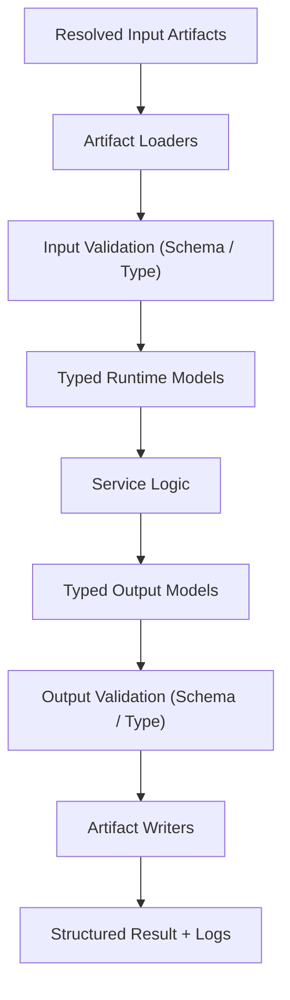

# linksmith-core

## Purpose

`linksmith-core` is the shared Python package that standardizes how LinkSmith services load artifacts, validate contracts, execute deterministic or LLM-backed transformations, validate outputs, and write results.

The goal is to remove repeated infrastructure code from individual services while keeping service-specific transformation logic small and explicit.

## Scope

This component is intended to provide:

- typed in-memory models for common runtime concepts
- artifact loading and writing for JSON and Markdown
- JSON Schema validation helpers
- a standard service execution lifecycle
- runtime context and error models
- structured logging helpers

This component is not intended to contain:

- business logic for specific services
- pipeline orchestration logic for the full engine
- service-specific prompts or templates
- non-JSON/Markdown artifact handling in v1

## Why A Separate Core Package

Without a shared package, every LinkSmith service would end up re-implementing the same flow:

1. read inputs
2. validate inputs
3. transform
4. validate outputs
5. write outputs
6. emit logs/errors

That duplication would drift and weaken the service contracts over time.

## Deterministic Vs LLM

- Classification: `deterministic-first shared runtime`
- Rationale:

The core package should remain deterministic. It should provide support for LLM-backed services, but not contain LLM-specific business logic itself.

This keeps the package focused on:

- type safety
- contract validation
- lifecycle consistency
- boundary handling

## Main Components

The initial package should likely contain the following modules:

### `linksmith_core.artifacts`

Responsibilities:

- load JSON artifacts
- load Markdown artifacts
- write JSON artifacts
- write Markdown artifacts
- normalize file handling around LinkSmith artifact concepts

### `linksmith_core.models`

Responsibilities:

- typed models for:
  - artifact descriptors
  - service inputs
  - service outputs
  - run results
  - validation outcomes

Preferred style:

- `dataclass` models
- raw dictionaries only at the boundary

### `linksmith_core.schemas`

Responsibilities:

- validate JSON data against JSON Schema
- report validation failures consistently
- provide a small wrapper around schema loading and validation

### `linksmith_core.service`

Responsibilities:

- define the standard service lifecycle abstraction
- provide a base service protocol or abstract base class
- make service implementation shape consistent

Possible lifecycle:

1. load inputs
2. validate inputs
3. execute transform or render logic
4. validate outputs
5. write outputs
6. return structured result

### `linksmith_core.runtime`

Responsibilities:

- runtime context object
- service execution orchestration for a single service invocation
- input resolution and output emission handling

This is not the full pipeline engine. It is the shared service runtime wrapper.

### `linksmith_core.errors`

Responsibilities:

- explicit error types for:
  - missing artifacts
  - malformed JSON
  - schema validation failure
  - invalid configuration
  - runtime execution failure

### `linksmith_core.logging`

Responsibilities:

- concise structured logging helpers
- stage-oriented logs that remain readable in Codex and CLI contexts

## Inputs

The shared package itself is not a registry service, but it must support service inputs with:

- port name
- type
- mode
- cardinality
- optional schema ref

Expected runtime inputs include:

- JSON file artifacts
- Markdown file artifacts
- directories of Markdown files
- previously resolved artifact references

## Outputs

The shared package itself is not a registry service, but it must support service outputs with:

- typed output descriptors
- JSON Schema validation before write for JSON outputs
- deterministic file emission for JSON and Markdown
- structured result objects for the caller

## Registry Contract Implications

`linksmith-core` should make it easier for registry-backed services to honor:

- input ports
- output ports
- `schemaRef`
- `mode`
- `cardinality`

It should not redefine the registry schema. It should implement runtime support for those contracts.

## Data Flow

At a high level, each service built on `linksmith-core` should follow this flow:

1. registry/pipeline context resolves input artifact locations
2. artifact loaders read data
3. schema validators validate JSON inputs where required
4. service logic receives typed inputs
5. service logic returns typed outputs
6. output validators validate JSON outputs where required
7. artifact writers emit final files
8. runtime returns structured result and logs

## Mermaid

## Failure Modes

Likely failure classes:

- missing input artifact
- unsupported artifact mode
- malformed JSON
- JSON Schema validation failure
- invalid service configuration
- service logic runtime failure
- output write failure

These should surface as explicit typed errors rather than generic exceptions where practical.

## Example Artifacts / Schema Refs

Relevant existing contracts and examples include:

- `schemas/registry.schema.json`
- `schemas/pipeline.schema.json`
- artifact schemas under `schemas/`
- example fixtures under `examples/artifacts/`

## Decisions

- Use a protocol-based service interface rather than an abstract base class.
- Cache loaded schemas in-process by resolved path.
- Normalize directory-mode Markdown inputs into typed artifact collections before service logic sees them.
- Keep LLM helper utilities outside `linksmith-core` in a separate package or service layer.
- Keep Markdown rendering helpers outside `linksmith-core` in a separate deterministic package or service layer.

These decisions keep the core package small, composable, and deterministic while still giving higher-level services a consistent runtime boundary.

## Implementation Notes

Recommended first implementation order:

1. `models`
2. `errors`
3. `schemas`
4. `artifacts`
5. `service`
6. `runtime`
7. `logging`

Testing expectations:

- deterministic unit tests for JSON/Markdown artifact loading and writing
- deterministic unit tests for schema validation wrappers
- lifecycle tests for the shared service runner
- fixture-based tests using existing schema examples where practical
