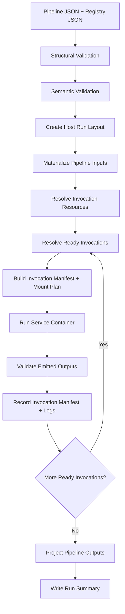

# linksmith-engine

## Purpose

`linksmith-engine` is the orchestration layer that runs LinkSmith pipelines over JSON and Markdown artifacts.

Its job is to:

- read a pipeline definition
- validate the structural and semantic wiring of the pipeline
- create a concrete pipeline run on the host
- invoke containerized services with resolved artifact mounts
- collect manifests, logs, and run outcomes

The engine is intentionally separate from `linksmith-core`.

This document describes the current implemented engine first, then notes a small amount of remaining design intent where relevant.

## Why A Separate Engine Layer

The engine solves problems that do not exist for a single isolated service invocation:

1. graph resolution
2. dependency ordering
3. host run-folder creation
4. artifact routing between invocations
5. container launch planning
6. retry and failure handling at invocation level
7. pipeline-level summaries

Those concerns should not be forced into the single-service runtime abstractions in `linksmith-core`.

## Deterministic Vs LLM

- Classification: `deterministic orchestration`
- Rationale:

The engine should remain deterministic.

It may invoke LLM-backed services, but the orchestration itself should not depend on LLM reasoning. Pipeline validation, dependency planning, path resolution, container launch, and run summaries should be driven by explicit code and declared contracts.

## Runtime Shape

The v1 runtime assumption is:

- the engine runs as local Python on the host
- services run as Docker containers
- artifacts remain on the host filesystem
- services receive artifacts through bind mounts

This avoids Docker-from-Docker complexity while preserving strong service boundaries.

## Scope

The engine is intended to provide:

- pipeline loading and structural validation
- semantic validation against the registry
- run-folder creation on the host
- topological readiness evaluation over invocation dependencies
- Docker-based service invocation
- per-invocation and per-run manifests
- pipeline-level logs and result summaries

The engine is not intended to provide:

- service-specific business logic
- service-specific prompt logic
- artifact parsing rules that belong inside services
- replacement of `linksmith-core`

## Relationship To `linksmith-core`

The engine should use `linksmith-core` selectively, not force itself into the same abstraction as a service.

Good reuse:

- shared contract models where appropriate
- artifact typing and IO helpers
- JSON Schema helpers
- shared error types
- future shared manifest helpers if they become stable

Avoid:

- pretending a whole pipeline run is just a `run_service` call
- pushing graph orchestration into service-runtime abstractions
- making engine state depend on service-only models

Rule of thumb:

- if the concern exists for a single isolated service invocation, it probably belongs in `linksmith-core`
- if the concern exists only because multiple invocations must be coordinated, it belongs in `linksmith-engine`

## Main Components

The current engine layer contains these implemented modules:

### `linksmith_engine.pipeline_loader`

Responsibilities:

- read pipeline JSON
- validate pipeline structure against schema
- map JSON into typed engine models
- resolve invocation `resources` into typed model entries

### `linksmith_engine.registry_loader`

Responsibilities:

- read the service registry
- validate registry structure against schema
- expose service contracts and runtime metadata

### `linksmith_engine.validator`

Responsibilities:

- validate semantic pipeline rules not covered by JSON Schema
- confirm services exist in the registry
- confirm referenced ports exist
- confirm connected types, modes, and cardinalities are compatible
- confirm bound invocation resources match service input contracts
- confirm resource paths exist and match expected file or directory mode
- reject double-binding of one input by both edge and resource

### `linksmith_engine.run_layout`

Responsibilities:

- create deterministic host run-folder structure
- resolve canonical input, output, manifest, and log paths
- expose run path helpers used by the rest of the engine

### `linksmith_engine.service_runner`

Responsibilities:

- define the engine-facing interface for invoking a service
- keep orchestration code independent from the concrete invocation backend

### `linksmith_engine.runtime_loader`

Responsibilities:

- read declarative engine runtime config JSON
- validate runtime config structure against schema
- resolve runtime service definitions into a concrete service runner
- keep Docker image and argument wiring out of pipeline definitions and tests

Expected first implementation:

- `DockerServiceRunner`

Possible later variants:

- `LocalProcessServiceRunner`
- `ContainerizedEngineServiceRunner`

### `linksmith_engine.engine`

Responsibilities:

- orchestrate the full run loop
- materialize pipeline inputs into the run folder
- resolve invocation readiness from incoming edges
- merge upstream artifacts with invocation resources
- stage invocation inputs and outputs
- validate declared outputs after execution
- project final pipeline outputs

### `linksmith_engine.manifest`

Responsibilities:

- write per-invocation manifests
- write the per-run summary manifest

### `linksmith_engine.runtime_loader`

Responsibilities:

- read declarative engine runtime config JSON
- validate runtime config structure against schema
- resolve runtime service definitions into a concrete service runner
- keep Docker image and argument wiring out of pipeline definitions

### `linksmith_engine.models`

Responsibilities:

- typed runtime representations of registry, pipeline, run-path, and manifest concepts

## Host Run Layout

The engine currently materializes each pipeline run into a deterministic host folder.

Suggested v1 layout:

```text
runs/<run-id>/
  pipeline/
    pipeline.json
    registry.json
  inputs/
  invocation-artifacts/
    <step-id>/
      <invocation-id>/
        inputs/
        outputs/
  manifests/
    run.json
    invocations/
      <step-id>.<invocation-id>.json
  logs/
    engine.log
    invocations/
      <step-id>.<invocation-id>.log
  outputs/
```

Purpose of the layout:

- `inputs/`
  holds pipeline entry artifacts resolved for the run
- `invocation-artifacts/.../inputs`
  holds the concrete mounted view or resolved input references for one invocation
- `invocation-artifacts/.../outputs`
  holds the direct emitted artifacts from one invocation
- `outputs/`
  holds pipeline-level exported outputs after final routing
- `manifests/`
  records what was planned, run, and produced

Current note:

- `pipeline/` currently stores copies of `pipeline.json` and `registry.json`
- invocation inputs are copied into run-local staging folders rather than mounted from original source locations

## Invocation Contract

The engine should treat each service invocation as a file-based contract over mounted folders.

At minimum, the engine must know:

- which service image or entrypoint to run
- which concrete input artifacts map to each service input port
- which invocation-scoped resource artifacts map to each service input port
- which output directories belong to each service output port
- which config values belong to the invocation

The service container should not need pipeline-level awareness. It should only see its own invocation contract.

In the current direction, Docker-specific image and argument wiring belongs in a separate runtime config document rather than in the pipeline JSON itself.

The same principle should apply to fixed per-invocation files such as prompt templates and Markdown templates:

- they should be declared in pipeline JSON as invocation resources
- they should be resolved by the engine into concrete mounted artifacts
- they should not require duplicate service implementations just because the resource files differ

That behavior is implemented now for invocation `resources`.

## Data Flow

At a high level, the engine should follow this flow:

1. read pipeline and registry JSON
2. validate both structures
3. run semantic pipeline validation against registry contracts
4. create the host run layout
5. materialize pipeline input artifacts into the run
6. resolve invocation-scoped resource artifacts
7. determine which invocations are initially ready
8. for each ready invocation:
   - resolve concrete input artifact paths
   - merge resolved run-time inputs and invocation resources into one service input set
   - prepare invocation input/output mount folders
   - write invocation manifest
   - run the service container
   - validate declared outputs
   - record status, output paths, and logs
9. continue until all invocations succeed or one blocks the run
10. project final pipeline outputs into the run `outputs/` folder
11. write the run summary manifest

Current execution model note:

- the engine currently resolves readiness by scanning remaining invocations for satisfied incoming edges
- execution is sequential today
- there is no separate planner module yet

## Mermaid



## Validation Intent

The engine should enforce semantic rules that go beyond JSON Schema:

- referenced service exists in registry
- referenced service ports exist
- connected artifact types are compatible
- connected modes are compatible
- connected cardinalities are compatible
- pipeline pseudo-endpoints map to declared pipeline inputs/outputs
- invocation resources map to declared service input ports with compatible type/mode/cardinality
- invocation outputs required by downstream edges were actually produced
- pipeline outputs must have incoming edges

## Failure Modes

Likely engine failure classes:

- pipeline JSON is malformed
- registry JSON is malformed
- semantic pipeline validation fails
- run folder cannot be created
- required input artifact is missing
- bind-mount planning fails on host paths
- Docker image is unavailable
- service container exits non-zero
- declared outputs are missing
- emitted outputs fail validation
- pipeline cannot progress because dependencies are unresolved or failed

These should surface as explicit engine-level failures with invocation context, not as vague pipeline errors.

## Run Manifest Shape

Each invocation currently produces a deterministic manifest with:

- `invocationId`
- `stepId`
- `service`
- `status`
- `inputs`
- `outputs`
- `exitCode`
- `logPath`
- optional `error`

The current manifest does not yet record timestamps.

Example shape:

```json
{
  "invocationId": "canvas",
  "stepId": "normalize",
  "service": "obsidian-canvas-to-relationships",
  "status": "succeeded",
  "inputs": {
    "canvas": ["runs/run-001/inputs/team.canvas"]
  },
  "outputs": {
    "relationships": [
      "runs/run-001/invocation-artifacts/normalize/canvas/outputs/relationships/relationships.json"
    ]
  },
  "exitCode": 0
}
```

## Open Questions

- Should the engine copy input artifacts into the run folder or reference them in place when safe?
- Should invocation inputs be mounted directly from upstream output folders or from engine-materialized input folders?
- Should retries be declared in the pipeline spec, registry, or a separate run policy?
- Do we want engine support for parallel ready invocations in v1, or strictly sequential execution first?
- Should the Docker runner read image/tag details from the registry entry directly, or from a separate runtime config mapping?
