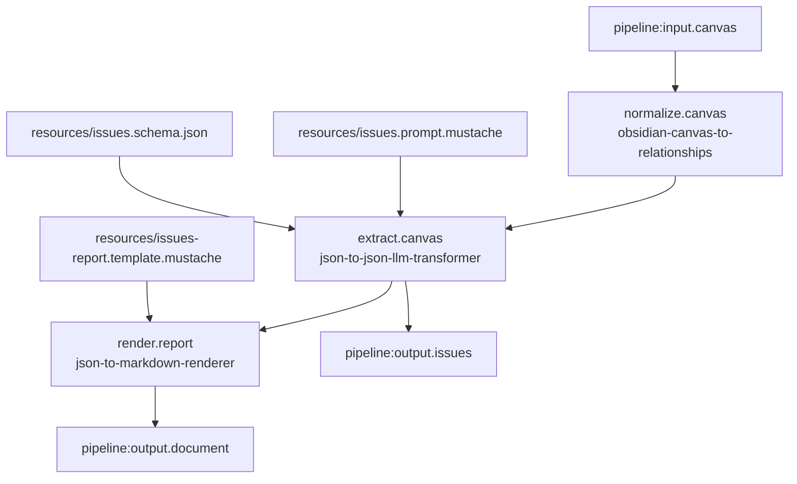

# Obsidian Canvas Issues Markdown Pipeline

## Purpose

Define a real LinkSmith pipeline that:

1. takes one Obsidian `.canvas` file as the external run-time input
2. converts it into deterministic `canvas-relationships` JSON
3. uses that JSON as input to an LLM-backed issue-extraction step with schema-constrained JSON output
4. renders the issues JSON into Markdown through a deterministic Mustache template

The goal is to separate structural normalization from semantic issue identification so the repo can reason about canvas points of interest more cleanly than the current summary-oriented pipeline.

## Scope

This pipeline is intentionally focused on issue extraction.

It is meant to prove:

- deterministic canvas normalization remains its own step
- issue identification is a separate semantic pass
- the LLM step can be schema-constrained around issue lists rather than broad summaries
- the resulting JSON is reusable in later role-mapping, principles-lens, and advisory pipelines
- one final deterministic Markdown render can still be produced for review

It is not meant to solve staffing recommendations yet.

## Proposed Pipeline Id

`obsidian-canvas-issues-markdown`

## External Run-Time Inputs

These should be supplied by the caller when the pipeline runs:

- `canvas`
  - type: `obsidian-canvas`
  - mode: `file`
  - cardinality: `one`
  - role: the source `.canvas` file to analyze

## Invocation-Scoped Resources

These should live inside the pipeline folder and be declared in `pipeline.json` as invocation `resources`:

- `issues.prompt.mustache`
  - bound to the LLM invocation input port `prompt`
- `issues.schema.json`
  - bound to the LLM invocation input port `schema`
- `issues-report.template.mustache`
  - bound to the renderer invocation input port `template`

These are fixed pipeline configuration artifacts, not per-run data.

## Final Outputs

The pipeline should expose two final outputs:

- `issues`
  - type: `json-document`
  - mode: `file`
  - cardinality: `one`
  - role: structured issue list extracted from the normalized canvas

- `document`
  - type: `markdown-document`
  - mode: `file`
  - cardinality: `one`
  - role: rendered Markdown report derived from the issues JSON

## Services

The pipeline should use these existing services:

- `obsidian-canvas-to-relationships`
  - input: `canvas`
  - output: `relationships`

- `json-to-json-llm-transformer`
  - input: `data`
  - input: `prompt`
  - input: `schema`
  - output: `result`

- `json-to-markdown-renderer`
  - input: `data`
  - input: `template`
  - output: `document`

Implementation note:

- the LLM step should use a pipeline-local alias so the generic `json-to-json-llm-transformer` remains reusable while this pipeline declares the narrower `canvas-relationships` input contract it needs

## Issues Output Shape

The initial schema should stay small enough for reliable JSON generation, but richer than the current summary pipeline.

Proposed top-level JSON shape:

```json
{
  "title": "string",
  "overview": "string",
  "issues": [
    {
      "id": "string",
      "title": "string",
      "category": "string",
      "priority": "high",
      "why_it_matters": "string",
      "signals": [
        "string"
      ],
      "open_questions": [
        "string"
      ],
      "recommended_next_steps": [
        "string"
      ]
    }
  ]
}
```

Rationale:

- `issues[]` shifts the output from broad summarization to distinct points of interest
- `category` and `priority` support later prioritization and grouping
- `signals` preserves the observable cues that drove the extraction
- `open_questions` makes uncertainty explicit instead of hiding it in prose
- `recommended_next_steps` creates an immediate downstream bridge into advisory work

## Main Data Flow

1. The pipeline receives the external `canvas` input.
2. `obsidian-canvas-to-relationships` produces deterministic `canvas-relationships` JSON.
3. `json-to-json-llm-transformer` receives that JSON as `data`.
4. The LLM invocation also receives a bound issue-extraction prompt and bound output schema as invocation resources.
5. The LLM step emits validated issues JSON.
6. `json-to-markdown-renderer` receives the issues JSON as `data`.
7. The renderer also receives a bound Mustache template as an invocation resource.
8. The renderer emits the final Markdown document.
9. The pipeline exports both the issues JSON and the Markdown document.

## Mermaid



## Proposed Real Pipeline Artifact Set

```text
pipelines/obsidian-canvas-issues-markdown/
  README.md
  pipeline.json
  registry.json
  runtime.json
  resources/
    issues.prompt.mustache
    issues.schema.json
    issues-report.template.mustache
  examples/
    input/
      context.canvas
    expected/
      issues.json
      document.md
```

## Constraints

- keep the canvas parsing deterministic and separate from semantic interpretation
- keep the issues schema small enough to reduce LLM flakiness
- keep the renderer deterministic and presentation-only
- keep the pipeline runnable without test helper code
- make the output reusable by later pipelines that map issues to roles and principles

## Implementation Boundary

After this design note is reviewed, implementation should create the real pipeline folder and artifacts.

That slice should include:

- `pipeline.json`
- `registry.json`
- `runtime.json`
- invocation resource files
- pipeline README
- example input and expected output artifacts
- a high-fidelity engine test around the pipeline
