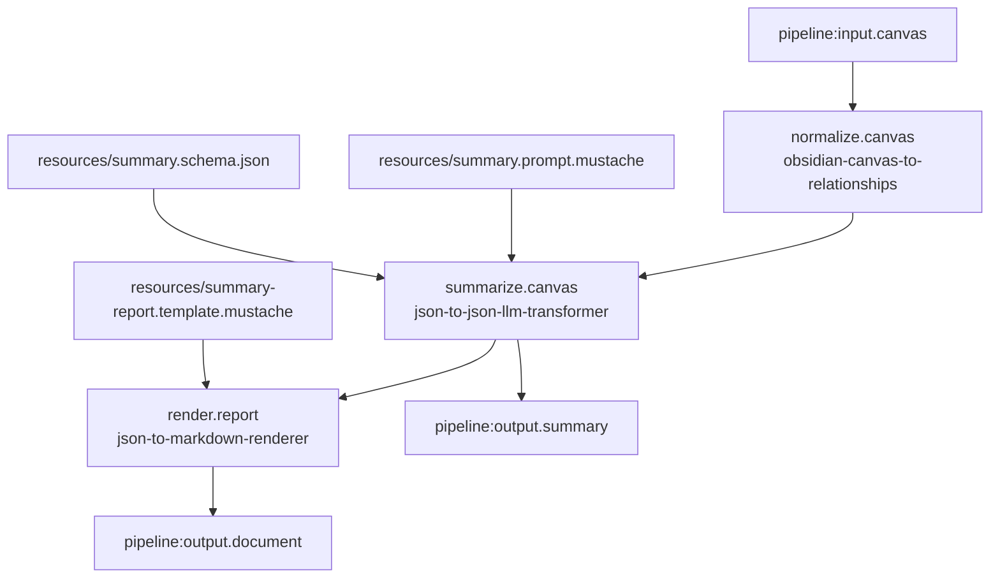

# Obsidian Canvas Summary Markdown Pipeline

## Purpose

Define a real LinkSmith pipeline that:

1. takes one Obsidian `.canvas` file as the external run-time input
2. converts it into deterministic `canvas-relationships` JSON
3. uses that JSON as input to an LLM-backed summarization step with schema-constrained JSON output
4. renders the summary JSON into Markdown through a deterministic Mustache template

The goal is to create the first canonical non-test pipeline artifact set for a simple but representative LinkSmith workflow.

## Scope

This pipeline is intentionally narrow.

It is meant to prove:

- real pipeline folder structure in the repo
- run-time inputs vs invocation-scoped resources
- one deterministic service feeding one LLM-backed service
- one deterministic render step consuming structured JSON
- a runnable end-to-end path that matches the current engine direction

It is not meant to solve broad canvas analysis yet.

## Proposed Pipeline Id

`obsidian-canvas-summary-markdown`

## External Run-Time Inputs

These should be supplied by the caller when the pipeline runs:

- `canvas`
  - type: `obsidian-canvas`
  - mode: `file`
  - cardinality: `one`
  - role: the source `.canvas` file to analyze

## Invocation-Scoped Resources

These should live inside the pipeline folder and be declared in `pipeline.json` as invocation `resources`:

- `summary.prompt.mustache`
  - bound to the LLM invocation input port `prompt`
- `summary.schema.json`
  - bound to the LLM invocation input port `schema`
- `summary-report.template.mustache`
  - bound to the renderer invocation input port `template`

These are fixed pipeline configuration artifacts, not per-run data.

## Final Outputs

The pipeline should expose two final outputs:

- `summary`
  - type: `json-document`
  - mode: `file`
  - cardinality: `one`
  - role: structured schema-constrained summary JSON from the LLM step

- `document`
  - type: `markdown-document`
  - mode: `file`
  - cardinality: `one`
  - role: rendered Markdown report derived from the summary JSON

## Services

The pipeline should use these existing services:

- `obsidian-canvas-to-relationships`
  - input: `canvas`
  - output: `relationships`

- `json-to-json-llm-transformer`
  - input: `data`
  - input: `prompt`
  - input: `schema`
  - output: `result`

- `json-to-markdown-renderer`
  - input: `data`
  - input: `template`
  - output: `document`

Implementation note:

- the real pipeline may use a pipeline-local registry alias for the LLM step so the shared generic `json-to-json-llm-transformer` contract does not drift across workflows

## Summary Output Shape

The initial schema should stay small and easy for the model to satisfy.

Proposed top-level JSON shape:

```json
{
  "title": "string",
  "overview": "string",
  "group_count": 0,
  "ungrouped_node_count": 0,
  "key_points": [
    "string"
  ]
}
```

Rationale:

- simple scalar fields reduce flaky JSON generation
- a short `key_points` array is enough to support useful Markdown rendering
- the structure is easy to inspect manually and easy to reuse in later pipelines

## Main Data Flow

1. The pipeline receives the external `canvas` input.
2. `obsidian-canvas-to-relationships` produces deterministic `canvas-relationships` JSON.
3. `json-to-json-llm-transformer` receives that JSON as `data`.
4. The LLM invocation also receives a bound summary prompt and bound output schema as invocation resources.
5. The LLM step emits validated summary JSON.
6. `json-to-markdown-renderer` receives the summary JSON as `data`.
7. The renderer also receives a bound Mustache template as an invocation resource.
8. The renderer emits the final Markdown document.
9. The pipeline exports both the summary JSON and the Markdown document as final outputs.

## Mermaid



## Proposed Real Pipeline Artifact Set

```text
pipelines/obsidian-canvas-summary-markdown/
  README.md
  pipeline.json
  runtime.json
  resources/
    summary.prompt.mustache
    summary.schema.json
    summary-report.template.mustache
```

Possible later additions:

- `examples/input/realistic-nested.canvas`
- `examples/expected/summary.json`
- `examples/expected/document.md`

## Registry And Runtime Notes

- Prefer reusing a shared executable registry if the repo reaches that state first.
- If the repo does not yet have one canonical shared runnable registry, a pipeline-local `registry.json` can be added for this example.
- `runtime.json` should hold Docker image tags, CLI argument wiring, output file naming, and LM Studio environment settings.
- `pipeline.json` should not carry Docker-specific wiring.

## Constraints

- The pipeline should use invocation resources for prompt, schema, and template from the start.
- The first version should keep the summary schema small to reduce LLM flakiness.
- The Markdown renderer should remain deterministic and presentation-only.
- The pipeline should be runnable without test helper code.

## Open Questions

- Should the first real example include pipeline-local example inputs and expected outputs immediately, or can that follow after the basic runnable slice?
- Should the first real example use a pipeline-local `registry.json`, or should we first extract a shared runnable registry at repo level?
- Do we want the summary schema to include per-group detail in v1, or should it stay intentionally compact until the real run quality is understood?

## Implementation Boundary

After this design note is reviewed, implementation should create the real pipeline folder and artifacts.

That next slice should include:

- `pipeline.json`
- `runtime.json`
- invocation resource files
- pipeline README
- a runnable command

The implementation step should stop short of broadening the service contracts unless the real pipeline reveals an actual contract gap.
