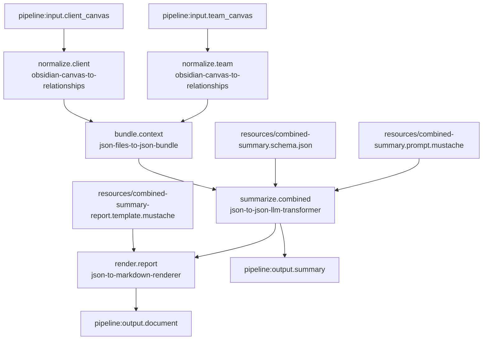

# Paired Canvas Bundle Summary Markdown Pipeline

## Purpose

Define a second real LinkSmith pipeline that is more representative than the first example by combining two separate canvas inputs before the LLM step.

The pipeline should:

1. take two Obsidian `.canvas` files as external run-time inputs
2. convert each canvas into deterministic `canvas-relationships` JSON independently
3. bundle the two resulting JSON documents into one provenance-preserving JSON artifact
4. summarize the combined bundle through one LLM-backed JSON transformation
5. render the summary JSON into Markdown through a deterministic template

The goal is to prove that LinkSmith can support:

- multiple external inputs
- multiple parallel deterministic steps
- deterministic many-to-one JSON composition
- one LLM step that consumes combined context
- a final deterministic render step

## Scope

This pipeline is intentionally more complex than `obsidian-canvas-summary-markdown`, but still narrow enough to stay reviewable.

It is meant to prove:

- two independent normalize branches
- convergence through the new `json-files-to-json-bundle` service
- one LLM summarization step over combined context
- one Markdown rendering step over structured JSON
- a realistic path toward client-space and principle-space reasoning later

It is not meant to solve broad multi-source advisory generation yet.

## Proposed Pipeline Id

`paired-canvas-bundle-summary-markdown`

## External Run-Time Inputs

These should be supplied by the caller when the pipeline runs:

- `team_canvas`
  - type: `obsidian-canvas`
  - mode: `file`
  - cardinality: `one`
  - role: team or principles-oriented canvas

- `client_canvas`
  - type: `obsidian-canvas`
  - mode: `file`
  - cardinality: `one`
  - role: client-context or problem-space canvas

## Invocation-Scoped Resources

These should live inside the pipeline folder and be declared in `pipeline.json` as invocation `resources`:

- `combined-summary.prompt.mustache`
  - bound to the LLM invocation input port `prompt`
- `combined-summary.schema.json`
  - bound to the LLM invocation input port `schema`
- `combined-summary-report.template.mustache`
  - bound to the renderer invocation input port `template`

These are fixed pipeline configuration artifacts, not per-run data.

## Final Outputs

The pipeline should expose two final outputs:

- `summary`
  - type: `json-document`
  - mode: `file`
  - cardinality: `one`
  - role: structured combined summary JSON from the LLM step

- `document`
  - type: `markdown-document`
  - mode: `file`
  - cardinality: `one`
  - role: rendered Markdown report derived from the combined summary JSON

## Services

The pipeline should use these existing services:

- `obsidian-canvas-to-relationships`
  - input: `canvas`
  - output: `relationships`

- `json-files-to-json-bundle`
  - input: `documents`
  - output: `bundle`

- `json-to-json-llm-transformer`
  - input: `data`
  - input: `prompt`
  - input: `schema`
  - output: `result`

- `json-to-markdown-renderer`
  - input: `data`
  - input: `template`
  - output: `document`

Implementation note:

- as with the first real pipeline, the LLM step should likely use a pipeline-local registry alias rather than the shared generic service id directly

## Combined Summary Output Shape

The output schema should stay deliberately small to reduce flakiness while still proving useful combined reasoning.

Proposed top-level JSON shape:

```json
{
  "title": "string",
  "combined_overview": "string",
  "source_highlights": [
    {
      "source_id": "string",
      "source_label": "string",
      "key_points": [
        "string"
      ]
    }
  ],
  "cross_cutting_themes": [
    "string"
  ],
  "recommended_focus_areas": [
    "string"
  ]
}
```

Rationale:

- small scalar and short array fields keep JSON generation simpler
- `source_highlights` proves the model can preserve source separation after bundling
- `cross_cutting_themes` proves the model can synthesize across both canvases
- `recommended_focus_areas` gives the Markdown renderer something practical to present

## Main Data Flow

1. The pipeline receives external `team_canvas` and `client_canvas` inputs.
2. `obsidian-canvas-to-relationships` runs for the team canvas.
3. `obsidian-canvas-to-relationships` runs for the client canvas.
4. `json-files-to-json-bundle` receives both resulting relationship JSON files through one `documents` input port.
5. The bundler emits one deterministic provenance-preserving JSON bundle.
6. `json-to-json-llm-transformer` receives the bundle as `data`.
7. The LLM invocation also receives a bound prompt and bound output schema as invocation resources.
8. The LLM step emits validated summary JSON.
9. `json-to-markdown-renderer` receives the summary JSON as `data`.
10. The renderer also receives a bound Mustache template as an invocation resource.
11. The renderer emits the final Markdown document.
12. The pipeline exports both the summary JSON and the Markdown document as final outputs.

## Mermaid



## Proposed Real Pipeline Artifact Set

```text
pipelines/paired-canvas-bundle-summary-markdown/
  README.md
  pipeline.json
  registry.json
  runtime.json
  resources/
    combined-summary.prompt.mustache
    combined-summary.schema.json
    combined-summary-report.template.mustache
  examples/
    input/
      sample-team.canvas
      sample-client.canvas
```

Possible later additions:

- `examples/expected/summary.json`
- `examples/expected/document.md`

## Registry And Runtime Notes

- keep a pipeline-local `registry.json` for now, consistent with the first real pipeline
- add `json-files-to-json-bundle` as a deterministic transform service in that registry
- use the same Docker runtime approach as the first real pipeline
- wire the bundler many-file input through the engine’s existing directory mount behavior

## Constraints

- the bundle step should preserve provenance rather than flattening two JSON objects together
- the first version should keep the combined summary schema small
- the Markdown renderer should remain deterministic and presentation-only
- the pipeline should be runnable without test helper code
- the pipeline should rely on declared invocation resources, not hard-coded prompt or template logic

## Open Questions

- should the `source_label` values in the summary schema be fixed by prompt convention, or should they be derived from bundle metadata only?
- should the first real version render both per-source highlights and cross-cutting themes, or keep the Markdown template even simpler?
- do we want the pipeline inputs named by technical role (`team_canvas`, `client_canvas`) or by broader domain concept later?

## Implementation Boundary

After this design note is reviewed, implementation should create the real pipeline folder and artifacts.

That next slice should include:

- `pipeline.json`
- `registry.json`
- `runtime.json`
- invocation resource files
- pipeline README
- example input canvases
- a runnable command

The implementation step should stop short of changing service contracts unless the real pipeline reveals a concrete gap.
