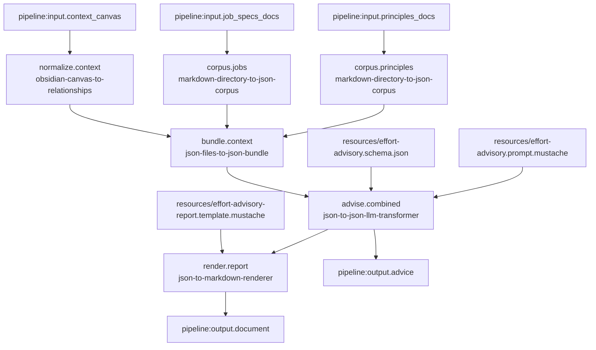

# Principles Jobs Canvas Effort Advisory Pipeline

## Purpose

Define a real LinkSmith pipeline that combines:

- company principles from a Markdown folder
- individual job specs from a Markdown folder
- one combined client-and-team canvas containing team seniority distribution and client details

and produces one issue-oriented advisory output focused on how the team's effort should be distributed.

The pipeline should:

1. take one company-principles Markdown folder as an external run-time input
2. take one job-specs Markdown folder as an external run-time input
3. take one combined client-and-team Obsidian `.canvas` file as an external run-time input
4. convert each Markdown folder into a deterministic JSON corpus artifact
5. convert the canvas into deterministic `canvas-relationships` JSON
6. bundle the three resulting JSON documents into one provenance-preserving JSON artifact
7. summarize the combined bundle through one LLM-backed JSON transformation
8. render the advisory JSON into Markdown through a deterministic template

The goal is to prove that LinkSmith can support a realistic advisory workflow that reasons across:

- organizational principles
- role expectations
- team composition and seniority mix
- client constraints and problem context

## Scope

This pipeline is intended to be the first real mixed-source advisory pipeline aligned with the actual user goal.

It is meant to prove:

- recursive Markdown folder ingestion for more than one source family
- mixed input modalities in one pipeline
- deterministic normalization of folder and canvas inputs
- deterministic many-to-one JSON composition
- one LLM step over combined organizational and client context
- one final deterministic Markdown render step

It is not meant to solve the full multi-stage advisory workflow yet.

Specifically, it does not yet include:

- a separate questions stage
- manual answers
- one Markdown file per issue
- multiple downstream advisory branches such as separate risks and team-leverage artifacts

Those can follow after the first effort-distribution pipeline is stable.

## Proposed Pipeline Id

`principles-jobs-canvas-effort-advisory-markdown`

## External Run-Time Inputs

These should be supplied by the caller when the pipeline runs:

- `principles_docs`
  - type: `markdown-directory`
  - mode: `directory`
  - cardinality: `one`
  - role: company-agnostic principles, operating norms, or internal guidelines

- `job_specs_docs`
  - type: `markdown-directory`
  - mode: `directory`
  - cardinality: `one`
  - role: individual job specifications describing role expectations and responsibilities

- `context_canvas`
  - type: `obsidian-canvas`
  - mode: `file`
  - cardinality: `one`
  - role: one combined canvas containing team seniority distribution, client context, issues, and opportunities

## Invocation-Scoped Resources

These should live inside the pipeline folder and be declared in `pipeline.json` as invocation `resources`:

- `effort-advisory.prompt.mustache`
  - bound to the LLM invocation input port `prompt`
- `effort-advisory.schema.json`
  - bound to the LLM invocation input port `schema`
- `effort-advisory-report.template.mustache`
  - bound to the renderer invocation input port `template`

These are fixed pipeline configuration artifacts, not per-run data.

## Final Outputs

The pipeline should expose two final outputs:

- `advice`
  - type: `json-document`
  - mode: `file`
  - cardinality: `one`
  - role: structured advisory JSON focused on team effort distribution

- `document`
  - type: `markdown-document`
  - mode: `file`
  - cardinality: `one`
  - role: rendered Markdown advisory report derived from that JSON

## Services

The pipeline should use these existing services:

- `markdown-directory-to-json-corpus`
  - input: `documents`
  - output: `corpus`

- `obsidian-canvas-to-relationships`
  - input: `canvas`
  - output: `relationships`

- `json-files-to-json-bundle`
  - input: `documents`
  - output: `bundle`

- `json-to-json-llm-transformer`
  - input: `data`
  - input: `prompt`
  - input: `schema`
  - output: `result`

- `json-to-markdown-renderer`
  - input: `data`
  - input: `template`
  - output: `document`

Implementation note:

- the two corpus branches and the canvas branch should likely use pipeline-local aliases so they can emit distinct output filenames and avoid many-file collision at the bundle step
- the bundler should likely use a pipeline-local alias with a narrowed input type strategy rather than generic `json-document`
- the LLM step should likely use a pipeline-local alias rather than the shared generic service id directly

## Advisory Output Shape

The first JSON output should align directly with the stated goal: deciding how the team's effort should be distributed.

Proposed top-level JSON shape:

```json
{
  "title": "string",
  "effort_distribution_overview": "string",
  "focus_areas": [
    {
      "id": "string",
      "title": "string",
      "why_it_matters": "string",
      "recommended_effort_split": "string",
      "principle_relevance": [
        "string"
      ],
      "role_implications": [
        "string"
      ],
      "recommended_actions": [
        "string"
      ]
    }
  ]
}
```

Rationale:

- `focus_areas[]` keeps the output client-first and issue-first
- `recommended_effort_split` makes the target outcome explicit rather than generic advisory prose
- `principle_relevance` ties the advice back to company principles
- `role_implications` ties the advice back to job specs and the team structure represented in the canvas
- the structure is still small enough to be realistically satisfiable by the model

Current v1 constraint:

- the existing renderer emits one Markdown document, not one file per focus area

So the first implementation should render one report with one section per focus area.

## Main Data Flow

1. The pipeline receives external `principles_docs`, `job_specs_docs`, and `context_canvas` inputs.
2. `markdown-directory-to-json-corpus` runs for the principles folder.
3. `markdown-directory-to-json-corpus` runs for the job specs folder.
4. `obsidian-canvas-to-relationships` runs for the combined team-and-client canvas.
5. A bundling step receives all three resulting JSON files through one `documents` input port.
6. The bundler emits one deterministic provenance-preserving JSON bundle.
7. `json-to-json-llm-transformer` receives that bundle as `data`.
8. The LLM invocation also receives a bound prompt and bound output schema as invocation resources.
9. The LLM step emits validated effort-distribution advisory JSON.
10. `json-to-markdown-renderer` receives the advisory JSON as `data`.
11. The renderer also receives a bound Mustache template as an invocation resource.
12. The renderer emits the final Markdown advisory document.
13. The pipeline exports both the advisory JSON and the Markdown document as final outputs.

## Mermaid



## Proposed Real Pipeline Artifact Set

```text
pipelines/principles-jobs-canvas-effort-advisory-markdown/
  README.md
  pipeline.json
  registry.json
  runtime.json
  resources/
    effort-advisory.prompt.mustache
    effort-advisory.schema.json
    effort-advisory-report.template.mustache
  examples/
    input/
      principles/
      job-specs/
      context.canvas
```

Possible later additions:

- `examples/expected/advice.json`
- `examples/expected/document.md`

## Registry And Runtime Notes

- keep a pipeline-local `registry.json` for now, consistent with the current real pipelines
- use pipeline-local aliases for the three normalization branches so the runtime can assign distinct output filenames such as:
  - `principles-corpus.json`
  - `job-specs-corpus.json`
  - `context-relationships.json`
- use a pipeline-local bundler alias so the service input type can be narrowed to the artifact types used here
- use the same Docker runtime approach as the current real pipelines

## Constraints

- the corpus collectors should preserve relative paths and Markdown provenance
- the canvas normalization should preserve structural relationships relevant to team/context reasoning
- the bundle step should preserve principles versus job specs versus canvas separation rather than flattening everything into one object implicitly
- the first version should keep the advisory schema small and stable
- the Markdown renderer should remain deterministic and presentation-only
- the pipeline should be runnable without test helper code
- the pipeline should rely on declared invocation resources, not hard-coded prompt or template logic

## Open Questions

- should the `recommended_effort_split` field be free text, or should the schema force a more structured shape later?
- should the first version include explicit citations back to corpus `sourceId` values and/or canvas group references in each focus area, or keep the schema simpler at first?
- do we want a follow-up pipeline to split one advisory JSON into one Markdown file per focus area, or is one report sufficient for the next slice?

## Implementation Boundary

After this design note is reviewed, implementation should create the real pipeline folder and artifacts.

That next slice should include:

- `pipeline.json`
- `registry.json`
- `runtime.json`
- invocation resource files
- pipeline README
- example Markdown input folders
- example canvas input
- a runnable command

The implementation step should stop short of adding per-focus-area Markdown directory rendering unless the first runnable version proves that gap is immediately painful.
