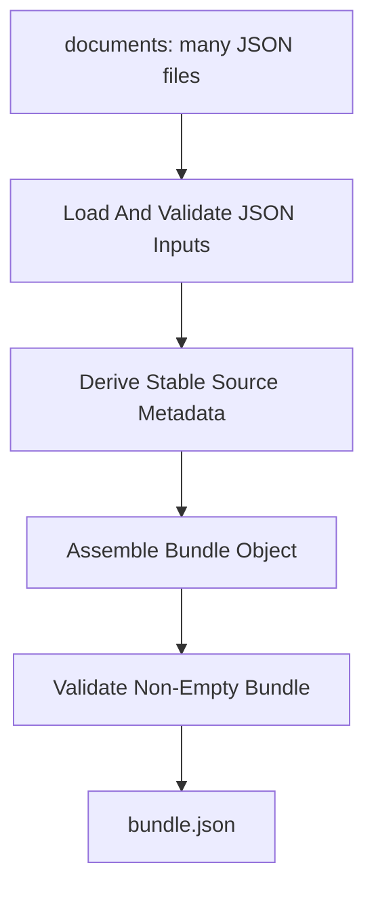

# json-files-to-json-bundle

## Purpose

Combine multiple input JSON documents into one deterministic JSON bundle artifact that can be consumed by later LinkSmith services which expect a single JSON file.

The goal is to support pipeline shapes where:

- multiple earlier steps emit separate JSON artifacts
- a later step needs all of that context
- the later step currently accepts one JSON file rather than many file inputs

This service should preserve provenance instead of flattening or ambiguously merging object keys.

## Why A Separate Service

This belongs as a distinct LinkSmith service rather than:

- an existing service extension
- engine logic
- a one-off script

Reasons:

- the engine should route artifacts, not impose a JSON composition strategy
- multiple later services may need the same "many JSON files into one JSON file" behavior
- deterministic bundling is a reusable artifact transformation in its own right
- keeping it separate avoids hard-coding LLM-step-specific context packing into the engine

This should not live in the engine because different pipelines may want different composition strategies later:

- preserve-as-list
- keyed object by alias
- deep merge
- schema-aware assembly

V1 should provide one conservative default that is explicit and reviewable.

## Deterministic Vs LLM

- Classification: `deterministic`
- Rationale:

The service is assembling existing JSON inputs into a stable output structure. No semantic synthesis is required. Deterministic code is both sufficient and preferable because:

- provenance matters
- collisions need explicit handling
- repeatability matters for downstream tests and prompts

## Inputs

- `documents`
  - type: `json-document`
  - mode: `file`
  - cardinality: `many`
  - schema ref: none

Possible later optional input, not required for v1:

- `config`
  - type: `json-document`
  - mode: `file`
  - cardinality: `one`
  - schema ref: future schema
  - rationale: support alternate bundle strategies without duplicating service code

## Outputs

- `bundle`
  - type: `json-bundle`
  - mode: `file`
  - cardinality: `one`
  - schema ref: `schemas/json-bundle.schema.json`

## Registry Contract Implications

The eventual registry entry will need to declare:

- one `documents` input port with `cardinality: many`
- one `bundle` output port with `cardinality: one`
- deterministic transform semantics
- container-friendly entrypoint
- output schema ref strategy

Important contract choice:

- input remains `json-document`
- output is not just another opaque `json-document`; it should communicate that the emitted file is a structured context bundle for later consumption

That makes the output contract clearer for both deterministic services and LLM-backed services.

## Data Flow

1. load all input JSON files from the `documents` port
2. validate that each artifact is valid JSON and that each root is an object or array
3. derive deterministic source metadata for each input:
   - ordinal position
   - source file name
   - relative path within the input port
4. assign a stable `sourceId` for each item
5. emit one bundle JSON object with:
   - artifact metadata
   - source references
   - bundled items preserving each original payload under its own `data` field
6. validate that the bundle is non-empty
7. write one output JSON file

Recommended output shape for v1:

```json
{
  "artifactType": "json-bundle",
  "items": [
    {
      "sourceId": "001-client-profile",
      "fileName": "client-profile.json",
      "relativePath": "client-profile.json",
      "data": {
        "name": "Example Client"
      }
    },
    {
      "sourceId": "002-principles-summary",
      "fileName": "principles-summary.json",
      "relativePath": "principles-summary.json",
      "data": {
        "principles": []
      }
    }
  ],
  "sourceRefs": [
    {
      "sourceId": "001-client-profile",
      "relativePath": "client-profile.json"
    },
    {
      "sourceId": "002-principles-summary",
      "relativePath": "principles-summary.json"
    }
  ]
}
```

V1 should sort inputs deterministically before assigning ids so output remains stable.

## Mermaid



## Failure Modes

- no input files are provided
- one or more input files are missing
- one or more input files are not valid JSON
- one or more input roots are not acceptable JSON shapes for bundling
- duplicate or unstable source ids would be produced
- output path cannot be written
- emitted bundle is empty

These should surface as explicit deterministic runtime errors.

## Example Artifacts / Schema Refs

Expected example fixtures for implementation:

- service fixtures:
  - `fixtures/services/json-files-to-json-bundle/input/`
  - `fixtures/services/json-files-to-json-bundle/expected/`

Likely first realistic inputs:

- two or three small JSON files representing outputs from earlier steps
- ideally including names that prove provenance is preserved

Relevant schema refs:

- `schemas/json-bundle.schema.json`

Expected tests:

- high-fidelity container test for many-file input to one-file output
- logic test for deterministic item ordering
- logic test for collision-resistant source id generation

## Open Questions

- Should v1 accept only object roots, or allow arrays as well?
- Should `sourceId` be derived from file name only, or ordinal plus sanitized file stem?
- Should the output include a top-level human-readable `summary`, or leave summarization to later steps?
- Should aliases from pipeline edges be captured later once the engine exposes them more directly?

## Implementation Notes

- Prefer preserving each source payload under `items[].data` rather than flattening keys.
- Prefer deterministic ids based on input order after stable path sorting, for example `001-client-profile`.
- Include both `fileName` and `relativePath` so downstream prompts can cite provenance.
- V1 should not attempt semantic merging, schema-aware joins, or deep object merge behavior.
- The service should compare JSON outputs structurally in tests rather than by raw formatting.
- Keep `context-artifact` available as a broader concept if it proves useful later, but use the dedicated `json-bundle` schema for this service contract.
