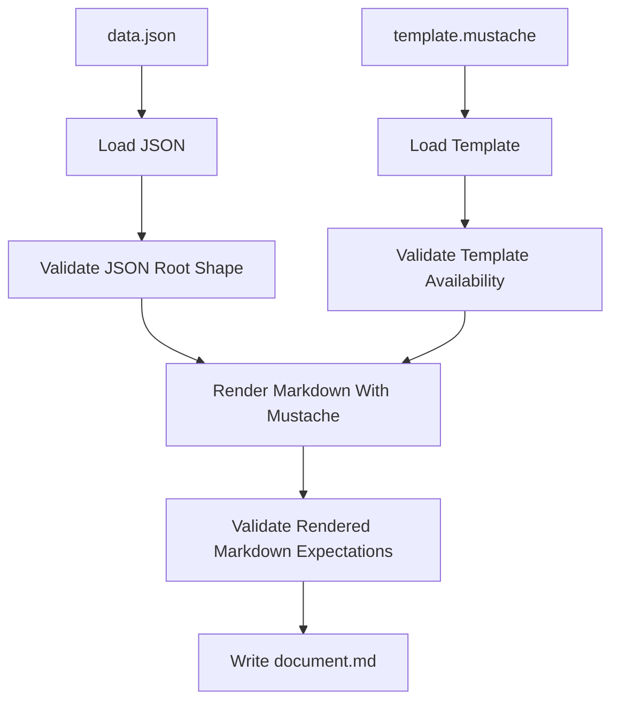

# json-to-markdown-renderer

## Purpose

Render a structured JSON payload into a Markdown artifact using a deterministic Mustache template.

The point of this service is to keep content shaping separate from presentation:

- upstream services produce structured JSON
- this service renders that JSON into stable Markdown
- downstream users and pipelines get predictable file output without introducing LLM variability

## Why A Separate Service

This belongs as a standalone LinkSmith service because it is:

- deterministic
- reusable across multiple pipelines
- a clean boundary between JSON processing and Markdown rendering

It should not live in the pipeline engine because the engine should orchestrate services, not embed service-specific rendering logic or template conventions.

## Deterministic Vs LLM

- Classification: `deterministic`
- Rationale:

Markdown rendering from known JSON and a known template is exact code work. There is no semantic synthesis requirement here. If the desired output can be expressed by a Mustache template and structured JSON, an LLM would only add flakiness and make the output contract weaker.

## Inputs

- `data`
  - type: `json-document`
  - mode: `file`
  - cardinality: `one`
  - schema ref: caller-specific in v1, none enforced by this service by default

- `template`
  - type: `mustache-template`
  - mode: `file`
  - cardinality: `one`
  - schema ref: none
  - recommended pipeline role: invocation-scoped resource rather than run-time pipeline input in most cases

## Outputs

- `document`
  - type: `markdown-document`
  - mode: `file`
  - cardinality: `one`
  - schema ref: none

## Registry Contract Implications

The registry entry will need to declare:

- deterministic render service
- one JSON file input
- one Mustache template file input
- one Markdown file output
- a container-friendly entrypoint

The runtime config will likely also need a fixed output filename argument such as `document.md`.

At pipeline level, this service also makes the need for invocation resources obvious:

- `data` is usually true run-time flow data from an upstream step
- `template` is usually a fixed rendering resource bound to one invocation

Those should not be modeled as the same category of thing just because both arrive as service inputs.

## Data Flow

1. load input JSON payload
2. validate the JSON root shape needed by the renderer
3. load Mustache template text
4. validate renderer configuration and output path arguments
5. render Markdown from JSON + template
6. validate rendered output against deterministic renderer expectations
7. write Markdown output

## Mermaid

## Failure Modes

- input JSON file is missing
- template file is missing
- input JSON is malformed
- input JSON root value is not an object
- template references data that is missing when strict mode is enabled
- rendered output is empty when non-empty output is required
- output path cannot be written

These should surface as explicit deterministic runtime errors.

## Example Artifacts / Schema Refs

- Service fixture pair:
  - `fixtures/services/json-to-markdown-renderer/input/basic-report.data.json`
  - `fixtures/services/json-to-markdown-renderer/input/basic-report.template.mustache`
  - `fixtures/services/json-to-markdown-renderer/expected/basic-report.document.md`

- Contract fixture candidates:
  - `fixtures/artifacts/markdown-document/valid/basic-report.valid.md`
  - `fixtures/artifacts/json-document/valid/basic-report.data.valid.json`

## Open Questions

- Should strict missing-key handling be mandatory in v1, or configurable with a fail-fast flag?
- Should the service support only JSON object roots in v1, or also arrays at the top level?
- Do we want a later optional third input for render metadata such as title, front matter, or output filename hints?
- Should `mustache-template` become a first-class artifact type in schemas and examples, or remain a registry/type convention first?

## Implementation Notes

- Use Mustache as the template format to keep rendering logic-less and reviewable.
- Prefer `chevron` as the initial Python library choice unless the implementation reveals a concrete limitation.
- Treat template rendering as presentation only; upstream services should reshape JSON before it reaches this renderer.
- The high-fidelity test should compare emitted Markdown to an expected `.md` fixture on disk.
- The service should remain container-first so the engine can invoke it exactly like future pipeline steps.
- After implementation, capture whether `linksmith-core` reduced renderer boilerplate enough or whether file/template handling still feels too ad hoc.
