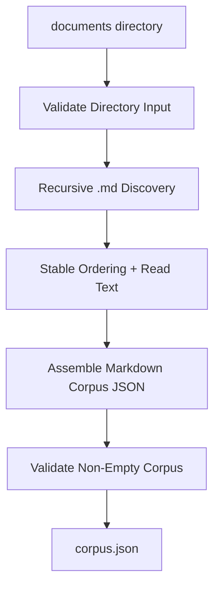

# markdown-directory-to-json-corpus

## Purpose

Read one directory recursively, include Markdown files only, and emit one deterministic JSON corpus artifact that can be consumed by later LinkSmith services such as `json-to-json-llm-transformer`.

The goal is to support pipeline shapes where:

- a source folder contains many Markdown files
- subfolders matter and should be preserved as provenance
- a later step wants one JSON artifact rather than many Markdown files

This service should make Markdown folder ingestion deterministic, reviewable, and reusable rather than pushing folder walking into the generic LLM service.

## Why A Separate Service

This belongs as a distinct LinkSmith service rather than:

- an existing service extension
- engine logic
- a one-off script

Reasons:

- the engine should route artifacts, not decide how directory contents become JSON context
- the generic LLM service should stay narrow: one final JSON input, one final prompt template, one final schema
- recursive Markdown ingestion is useful in more than one pipeline
- provenance preservation and filtering are deterministic concerns, not LLM concerns

It should not be merged into the current JSON bundler because the inputs and responsibilities differ:

- `json-files-to-json-bundle` bundles already-structured JSON files
- this new service reads raw Markdown text files from a directory and turns them into a new JSON corpus shape

## Deterministic Vs LLM

- Classification: `deterministic`
- Rationale:

The service is just:

- recursively walking a folder
- filtering for `.md`
- reading text
- preserving provenance
- emitting a stable JSON structure

No semantic synthesis is required. Deterministic code is the correct choice.

## Inputs

- `documents`
  - type: `markdown-directory`
  - mode: `directory`
  - cardinality: `one`
  - schema ref: none

Possible later optional input, not required for v1:

- `config`
  - type: `json-document`
  - mode: `file`
  - cardinality: `one`
  - schema ref: future schema
  - rationale: allow file include/exclude rules, maximum file size, or frontmatter handling later without duplicating service code

## Outputs

- `corpus`
  - type: `markdown-corpus`
  - mode: `file`
  - cardinality: `one`
  - schema ref: `schemas/markdown-corpus.schema.json`

## Registry Contract Implications

The eventual registry entry will need to declare:

- one `documents` directory input
- one `corpus` JSON file output
- a dedicated corpus schema rather than a generic `json-document` schema
- deterministic transform semantics
- container-friendly entrypoint

Important contract choice:

- the service should consume one directory input rather than `many` Markdown files

That fits the real use case better:

- the engine already supports directory inputs cleanly
- recursive traversal belongs inside the service
- callers do not need a separate deterministic step just to enumerate files

## Data Flow

1. receive one directory through the `documents` input port
2. validate that the input is a directory and exists
3. recursively enumerate files under that directory
4. include only files with a `.md` extension
5. sort files deterministically by relative path
6. read each Markdown file as UTF-8 text
7. assign a stable `sourceId` to each included file
8. emit one corpus JSON object containing:
   - artifact metadata
   - one item per Markdown file
   - source references for provenance
9. validate that the emitted corpus is non-empty
10. write one output JSON file

Recommended output shape for v1:

```json
{
  "artifactType": "markdown-corpus",
  "items": [
    {
      "sourceId": "001-principles",
      "fileName": "principles.md",
      "relativePath": "team/principles.md",
      "content": "# Principles\n..."
    },
    {
      "sourceId": "002-client-notes",
      "fileName": "client-notes.md",
      "relativePath": "client/client-notes.md",
      "content": "# Client Notes\n..."
    }
  ],
  "sourceRefs": [
    {
      "sourceId": "001-principles",
      "relativePath": "team/principles.md"
    },
    {
      "sourceId": "002-client-notes",
      "relativePath": "client/client-notes.md"
    }
  ]
}
```

V1 should exclude non-Markdown files entirely rather than listing them as ignored entries.

## Mermaid



## Failure Modes

- input directory is missing
- input path is not a directory
- directory contains no Markdown files
- one or more Markdown files cannot be read
- duplicate relative paths would be produced
- output path cannot be written
- emitted corpus is empty

These should surface as explicit deterministic runtime errors.

## Example Artifacts / Schema Refs

Expected example fixtures for implementation:

- service fixtures:
  - `fixtures/services/markdown-directory-to-json-corpus/input/documents/`
  - `fixtures/services/markdown-directory-to-json-corpus/expected/`

Likely first realistic inputs:

- a small nested folder tree with:
  - multiple `.md` files
  - at least one non-Markdown file that should be ignored
  - nested relative paths that prove provenance is preserved

Relevant schema refs:

- new schema:
  - `schemas/markdown-corpus.schema.json`

Expected tests:

- high-fidelity container test for directory-in to JSON-out behavior
- logic test for deterministic ordering by relative path
- logic test proving non-Markdown files are ignored
- logic test proving empty Markdown discovery fails clearly

## Open Questions

- should v1 preserve raw Markdown exactly, or normalize line endings?
- should v1 include optional summary fields such as character count or heading count, or keep the artifact minimal?
- should future versions extract frontmatter separately, or leave Markdown content opaque for now?

## Implementation Notes

- Reuse the stable `sourceId` and `relativePath` ideas from `json-files-to-json-bundle`.
- Do not create a shared base class yet.

Reason:

- there is some overlap in source ordering and source-id generation
- but the input loading model is materially different: JSON file artifacts versus recursive directory text ingestion
- extracting a common base before a second or third similar collector exists would likely create more abstraction than value

Recommended implementation strategy:

- keep the first version standalone
- if we later build another folder-to-corpus collector, extract shared helpers such as:
  - relative path resolution
  - stable source id generation
  - corpus item construction

Likely main module:

- `src/linksmith_services/markdown_directory_to_json_corpus.py`

Likely CLI shape:

- `--documents-dir`
- `--output-dir`
- `--output-file-name`
- `--schema-base-dir`

This keeps the container interface aligned with the existing bundler and the engine’s directory-mount behavior.
