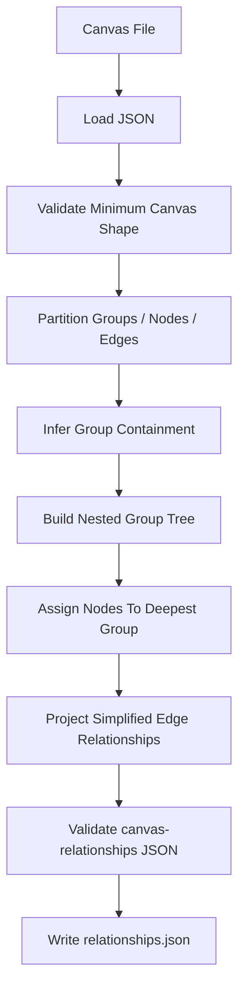

# obsidian-canvas-to-relationships

## Purpose

Convert an Obsidian `.canvas` file into a simplified JSON artifact that captures:

- nested group structure
- nodes within each group
- ungrouped nodes
- edges between nodes
- edge relationship context relative to group nesting

The point is to preserve the relationship model without leaking layout-heavy canvas details into downstream services.

## Why A Separate Service

This belongs as a standalone LinkSmith service because it is:

- deterministic
- reusable across multiple pipelines
- a stable input-normalization step for later analysis services

It should not live in the pipeline engine because the engine should orchestrate services, not contain service-specific canvas parsing logic.

## Deterministic Vs LLM

- Classification: `deterministic`
- Rationale:

The transformation is structural. Group membership and nested group relationships should be inferred from geometry and containment rules, not from semantic model output.

## Inputs

- `canvas`
  - type: `obsidian-canvas`
  - mode: `file`
  - cardinality: `one`
  - schema ref: none in v1

## Outputs

- `relationships`
  - type: `canvas-relationships`
  - mode: `file`
  - cardinality: `one`
  - schema ref: `schemas/canvas-relationships.schema.json`

## Registry Contract Implications

The registry entry will need to declare:

- deterministic transform service
- one `.canvas` file input
- one `canvas-relationships` JSON output
- output schema ref to `schemas/canvas-relationships.schema.json`
- a container-friendly entrypoint

## Data Flow

1. load `.canvas` JSON input
2. validate minimum canvas shape needed for deterministic parsing
3. split nodes into groups vs ordinary nodes
4. infer direct group containment from bounds
5. infer nested group hierarchy from direct containment
6. assign nodes to their most-specific containing group
7. compute ungrouped nodes
8. project edges into simplified relationship form
9. validate output against `canvas-relationships` schema
10. write output JSON

## Mermaid

## Failure Modes

- input file is missing
- input file is not valid JSON
- canvas root object is malformed
- required node identifiers are missing
- group bounds are malformed or incomplete
- ambiguous containment rules produce inconsistent direct parents
- edge references a node that does not exist
- output fails schema validation

These should surface as explicit deterministic runtime errors.

## Example Artifacts / Schema Refs

- Output schema:
  - `schemas/canvas-relationships.schema.json`
- Service fixture pair:
  - `fixtures/services/obsidian-canvas-to-relationships/input/realistic-nested.canvas`
  - `fixtures/services/obsidian-canvas-to-relationships/expected/realistic-nested.relationships.json`
- Contract fixture:
  - `fixtures/artifacts/canvas-relationships/valid/realistic-nested-groups.valid.json`

## Open Questions

- Do we want a formal input schema for supported `.canvas` files in v1, or only minimal runtime validation?
- Should text node content be preserved in the output when present, or should the relationships artifact stay mostly structural?
- Should overlapping groups without strict containment fail hard or use a deterministic tie-break rule?

## Implementation Notes

- The container test should compare canonicalized JSON structures rather than raw file strings.
- The service should expose its transformation logic in a narrow pure function so unit tests can target group nesting directly.
- This service is the first real test of whether `linksmith-core` is reducing boilerplate enough for deterministic services.
- Longer term, the same core lifecycle should be reusable by the pipeline engine, which is effectively a higher-order orchestrated runtime over many service invocations.
