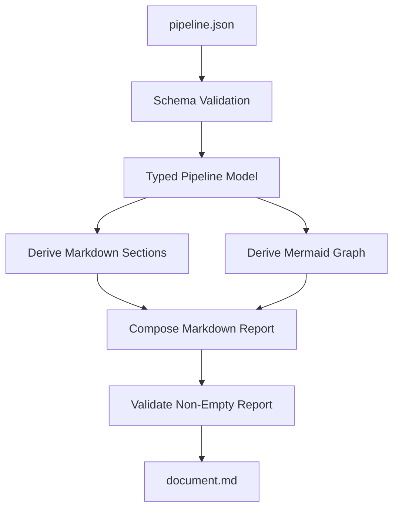

# pipeline-json-to-markdown-renderer

## Purpose

Render a LinkSmith pipeline definition JSON file into a Markdown document that includes:

- a human-readable summary of the pipeline
- the declared external inputs and final outputs
- the steps and invocations involved
- the artifact flow between invocations
- a Mermaid diagram derived deterministically from the pipeline graph

The goal is to make pipeline shape easier to review without reading raw `pipeline.json` directly.

## Why A Separate Service

This belongs as a distinct LinkSmith service rather than:

- an existing service extension
- engine logic
- a one-off script

Reasons:

- it is a reusable deterministic transformation from one LinkSmith artifact into another
- it is useful both as a standalone documentation tool and as a future pipeline step
- it keeps documentation rendering separate from engine orchestration
- it supports the earlier "pipeline pipeline" idea without forcing Markdown/Mermaid concerns into the engine

It should not live in the engine because the engine should execute pipelines, not own service-specific rendering logic for pipeline explanation artifacts.

## Deterministic Vs LLM

- Classification: `deterministic`
- Rationale:

The transformation is structural. The service can derive all required content directly from `pipeline.json`:

- ids
- ports
- invocations
- edges
- resources

No semantic synthesis is required for the first useful version. Using an LLM here would weaken repeatability and make graph rendering less trustworthy.

## Inputs

- `pipeline`
  - type: `linksmith-pipeline-definition`
  - mode: `file`
  - cardinality: `one`
  - schema ref: `schemas/pipeline.schema.json`

Possible later optional inputs, not required for v1:

- `template`
  - type: `mustache-template`
  - mode: `file`
  - cardinality: `one`
  - schema ref: none
  - rationale: allow custom report layouts later if needed

## Outputs

- `document`
  - type: `markdown-document`
  - mode: `file`
  - cardinality: `one`
  - schema ref: none

Possible later optional output, not required for v1:

- `summary`
  - type: `json-document`
  - mode: `file`
  - cardinality: `one`
  - schema ref: future schema if we want a machine-readable intermediate graph view

## Registry Contract Implications

The eventual registry entry will need to declare:

- deterministic render or transform service
- one pipeline-definition JSON file input
- one Markdown document output
- schema validation for the pipeline-definition input
- container-friendly entrypoint

The most important contract decision for v1 is introducing a stable pipeline-definition artifact type such as:

- `linksmith-pipeline-definition`

That is clearer than using generic `json-document` everywhere, because this service is specifically about LinkSmith pipeline contracts.

## Data Flow

1. load the pipeline definition JSON file
2. validate it against the LinkSmith pipeline schema
3. map the JSON into typed pipeline models
4. derive documentation sections:
   - metadata
   - external inputs
   - outputs
   - steps and invocations
   - invocation resources
   - edges
5. derive Mermaid nodes and edges deterministically from the pipeline graph
6. render a Markdown report that embeds the Mermaid diagram
7. validate that the rendered Markdown is non-empty and structurally complete enough for v1
8. write the Markdown output

## Mermaid

## Failure Modes

- input file is missing
- input file is not valid JSON
- input JSON does not satisfy `schemas/pipeline.schema.json`
- required pipeline sections are missing or malformed after loading
- graph derivation fails because endpoints are invalid or unexpectedly shaped
- Mermaid node naming or escaping produces invalid diagram content
- Markdown output is empty
- output path cannot be written

These should surface as explicit deterministic runtime errors.

## Example Artifacts / Schema Refs

Expected example fixtures for implementation:

- service fixtures:
  - `fixtures/services/pipeline-json-to-markdown-renderer/input/`
  - `fixtures/services/pipeline-json-to-markdown-renderer/expected/`

Likely first realistic input:

- `pipelines/obsidian-canvas-summary-markdown/pipeline.json`

Relevant schema refs:

- `schemas/pipeline.schema.json`

Potential reusable expected artifact:

- a reviewed Markdown file containing:
  - a Mermaid diagram
  - extracted inputs
  - extracted outputs
  - step/invocation summaries

## Open Questions

- Should v1 generate Markdown through fixed code only, or should it allow an optional template input from the start?
- Should invocation resources be listed inline under each invocation section, or summarized separately as a pipeline resource inventory?
- Should Mermaid nodes represent steps only, or fully-qualified invocations?
- Should the service validate only pipeline schema, or also run semantic validation against a registry when a registry input is later added?
- Do we want this first version to target any valid LinkSmith pipeline JSON, or only pipelines that already satisfy the current engine semantic expectations?

## Implementation Notes

- Prefer a fixed deterministic Markdown layout for v1. Keep templating out until a real need appears.
- Reuse the existing pipeline loader and typed models rather than reparsing the JSON manually.
- Prefer invocation-level Mermaid nodes for accuracy, because edges already resolve at invocation-port level.
- Escape Mermaid labels conservatively so ids, dots, and hyphens render predictably.
- Add a high-fidelity fixture test that compares emitted Markdown to an expected `.md` artifact on disk.
- Add narrow deterministic tests for graph derivation and Mermaid rendering helpers.
- If this proves useful, it may later become a standard documentation step in pipeline workflows.
