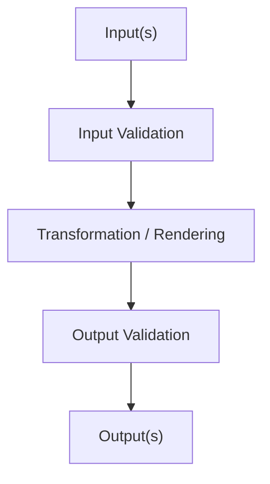

# <service-id>

## Purpose

What problem this service solves.

## Why A Separate Service

Why this belongs as a distinct LinkSmith service rather than:

- an existing service extension
- engine logic
- a one-off script

## Deterministic Vs LLM

- Classification: `deterministic` or `llm-backed`
- Rationale:

## Inputs

List each input port with:

- name
- type
- mode
- cardinality
- schema ref if relevant

## Outputs

List each output port with:

- name
- type
- mode
- cardinality
- schema ref if relevant

## Registry Contract Implications

What the eventual registry entry will need to declare.

## Data Flow

Describe the service lifecycle:

1. load inputs
2. validate inputs
3. transform/render
4. validate outputs
5. write outputs

## Mermaid

## Failure Modes

List likely failure cases and how they should surface.

## Example Artifacts / Schema Refs

Reference example fixtures and JSON Schemas that should exist or be added.

## Open Questions

Anything still unresolved before implementation.

## Implementation Notes

Optional notes about expected modules, helpers, shared package usage, or testing implications.
