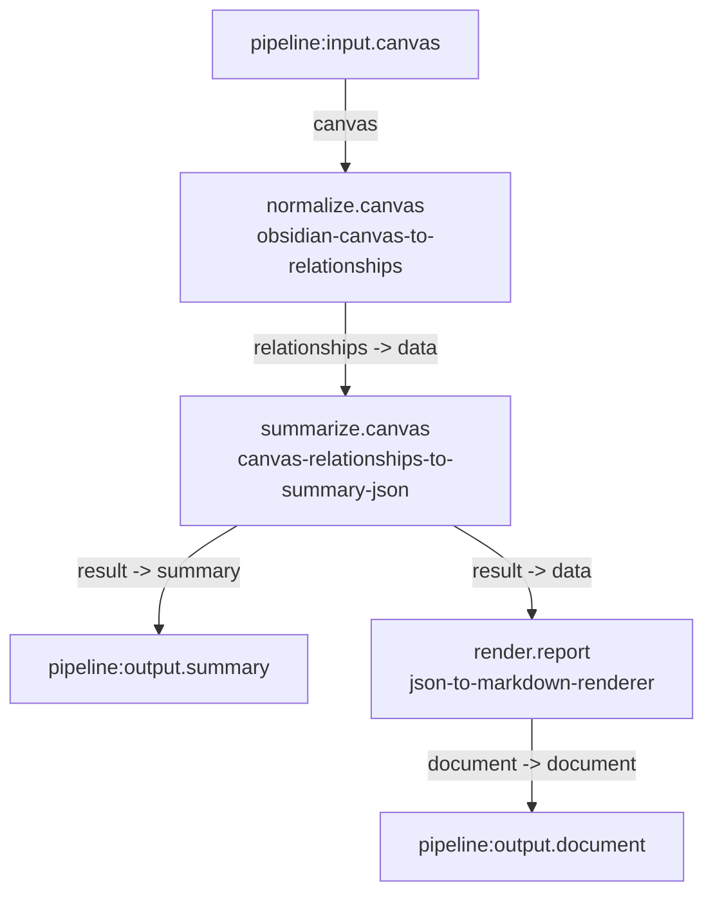

# Obsidian Canvas Summary Markdown

`obsidian-canvas-summary-markdown`

Convert an Obsidian canvas into relationships JSON, summarize it through an LLM-backed JSON transformation, and render the result as Markdown.

## Inputs

- `canvas` (`obsidian-canvas`, `file`, `one`): Source Obsidian canvas file.

## Outputs

- `summary` (`json-document`, `file`, `one`): Structured summary JSON generated from the canvas relationships.
- `document` (`markdown-document`, `file`, `one`): Rendered Markdown report derived from the summary JSON.

## Steps

### `normalize`

Convert the raw canvas into deterministic relationships JSON.

- Invocation: `normalize.canvas`
- Service: `obsidian-canvas-to-relationships`

### `summarize`

Summarize the canvas relationships into a compact JSON report.

- Invocation: `summarize.canvas`
- Service: `canvas-relationships-to-summary-json`
- Resource: `prompt` (`mustache-template`, `file`, `one`) -> `resources/summary.prompt.mustache`
- Resource: `schema` (`json-document`, `file`, `one`) -> `resources/summary.schema.json`

### `render`

Render the summary JSON into Markdown.

- Invocation: `render.report`
- Service: `json-to-markdown-renderer`
- Resource: `template` (`mustache-template`, `file`, `one`) -> `resources/summary-report.template.mustache`

## Edges

- `pipeline:input.canvas` -> `normalize.canvas.canvas`
- `normalize.canvas.relationships` -> `summarize.canvas.data`
- `summarize.canvas.result` -> `pipeline:output.summary`
- `summarize.canvas.result` -> `render.report.data`
- `render.report.document` -> `pipeline:output.document`

## Mermaid

